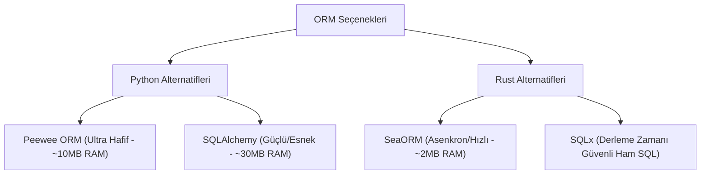

# UYAP & Veritabanı Optimizasyon ve Mimari Önerileri

Bu doküman, çok kullanıcılı UYAP entegrasyonu ve merkezi PostgreSQL veritabanı içeren sistemlerde **bellek (RAM) kullanımını en aza indirmek** ve **veri iletişim hızını (ağ ve veritabanı) en üst düzeye çıkarmak** için geliştirilmiş mimari önerileri içermektedir.

---

## 1. Veritabanı ve Ağ Mimarisi

Çok kullanıcılı (Merkezi PostgreSQL) sistemlerde yerel istemcilerin (client) hızı ve kaynak tüketimi için aşağıdaki prensipler uygulanmalıdır.

### İstemcilerde Sıfır Sunucu Yükü (0 MB RAM)
Merkezi PostgreSQL modelinde, `postgres.exe` veritabanı sunucusu **sadece tek bir merkez bilgisayarda (Sunucu)** çalışır. 
* İstemci (User) bilgisayarlarında hiçbir veritabanı motoru çalışmaz.
* İstemciler veritabanına doğrudan TCP portu (varsayılan `5432`) üzerinden bağlanır.
* Bu durum istemci bilgisayarlardaki RAM yükünü doğrudan sıfırlar. Sadece veritabanıyla konuşan hafif bir sürücü (Python'da `asyncpg` veya Rust'ta `tokio-postgres`) kullanılır.

### İstemcide SQLite + Sunucuda PostgreSQL Hibrit Modeli Mantıklı mı?
**Öneri: Hayır.** Yerel bilgisayarlarda SQLite kullanıp verileri arka planda PostgreSQL'e senkronize etmek (çift yönlü senkronizasyon), icra dosyaları gibi birbirine sıkı sıkıya bağlı (ilişkisel) verilerde çok ciddi **çakışmalara (conflict)** ve veri tutarsızlığına yol açar.
* **Alternatif Hızlandırma Yöntemi (Yerel Bellek Önbelleği - Memory Cache):** Sürekli değişmeyen verileri (adliyeler, icra daireleri, kurum listeleri, avukat bilgileri gibi referans tabloları) istemci tarafında bellek içinde (RAM cache veya geçici bir SQLite dosyasında) tutun. İcra dosyaları ve borçlu kayıtları gibi hareketli verileri ise doğrudan merkezi PostgreSQL'e sorgulayın. Yerel ağda (LAN) PostgreSQL sorguları zaten 1-5 ms arasında döner.

---

## 2. İlişkisel Veritabanı (ORM) Alternatifleri

Zincirli ve ilişkili verileri (Alacaklı $\rightarrow$ Borçlu $\rightarrow$ İcra Dosyası $\rightarrow$ Hesap Tablosu/Evraklar) yönetirken kullanılabilecek ORM alternatifleri:

### A. Peewee ORM (Python)
Django ORM'e çok benzeyen, küçük ve son derece anlaşılır bir Python ORM'idir.
* **Avantajları:** Öğrenme eğrisi sıfıra yakındır. Django ORM'de yazdığınız ilişkilerin neredeyse aynısını yazar ve Django'nun getirdiği 80 MB'lık RAM yükünden kurtulursunuz (~10 MB RAM harcar).
* **Dezavantajları:** Çok büyük veri yığınlarında (bulk operations) ve çok karmaşık sorgularda SQLAlchemy kadar optimize çalışmayabilir.

### B. SQLAlchemy (Python)
Python dünyasının Django dışındaki tartışmasız en güçlü ve esnek ORM sistemidir.
* **SQLAlchemy Nedir?** İki katmandan oluşur: **Core** (SQL sorgu oluşturucu) ve **ORM** (İlişkisel haritalama). Django ORM'den farklı olarak, "Active Record" değil "Data Mapper" desenini kullanır. Yani veritabanı tablolarıyla Python sınıflarını birbirinden tamamen bağımsız yönetmenize izin verir.
* **İlişki Yönetimi:** Zincirli ilişkileri (`relationship()`, `backref()`, `lazy='joined'`) yönetmede uzmandır. N+1 sorgu problemlerini önlemek için tek bir sorguda tüm alt ilişkileri çekecek (Eager Loading) gelişmiş optimizasyon araçlarına sahiptir.
* **Bellek/Hız:** Django'ya göre çok daha hafiftir ancak Peewee'den biraz daha fazla bellek tüketebilir.

### C. SeaORM (Rust)
Rust ekosistemindeki asenkron, dinamik ve tam özellikli ilişkisel ORM'dir.
* **Hız ve Güvenlik:** Rust'ın hızını ve bellek güvenliğini asenkron veritabanı sürücüsü `SQLx` ile birleştirir.
* **İlişkiler:** Rust'ın makro sistemini kullanarak `HasOne`, `HasMany` ve `BelongsTo` ilişkilerini tanımlar. Compile-time tür güvenliği sayesinde veritabanı hatalarını daha kod derlenirken yakalarsınız.
* **RAM:** Neredeyse sıfır runtime overhead ile çalışır (sadece birkaç megabayt).

---

## 3. UYAP El Sıkışma, İstek ve Sorgu Optimizasyonları

UYAP (avukat.uyap.gov.tr) ile entegre çalışan sistemlerde en büyük darboğaz ağ gecikmesi (latency) ve oturum yönetimidir. Bu kısmı hızlandırmak için teknik reçete aşağıdadır:

### 1. TCP ve TLS Bağlantı Havuzu (Connection Pooling)
Her UYAP isteğinde sıfırdan HTTPS bağlantısı açmak, her seferinde **TCP Handshake + SSL/TLS Handshake** yapılmasına neden olur. Bu da Türkiye içi ağlarda istek başına fazladan **150 ms - 400 ms** kayıp demektir.
* **Çözüm:** Bağlantıyı sürekli açık tutan (Keep-Alive) tek bir istemci nesnesi (Python'da `httpx.AsyncClient`, Rust'ta `reqwest::Client`) uygulama başlangıcında oluşturulmalı ve tüm istekler bu havuz üzerinden atılmalıdır.
* **Rust Avantajı:** `reqwest` arka planda bağlantı havuzunu işletim sistemi seviyesinde son derece agresif yönetir ve bağlantıları milisaniyeler içinde geri kazanır.

### 2. HTTP/2 Multiplexing Desteği
UYAP sunucuları HTTP/2 protokolünü desteklemektedir. HTTP/2, aynı TCP bağlantısı üzerinden birden fazla isteğin aynı anda gönderilip alınmasını (multiplexing) sağlar.
* **Uygulama:** İstemcinizde HTTP/2 desteğini mutlaka aktif edin.
  * Python'da: `httpx.AsyncClient(http2=True)`
  * Rust'ta: `reqwest::Client::builder().use_rustls_tls().http2_prior_knowledge().build()?`

### 3. Akıllı Oturum (Session Cookie) ve Canlı Tutma (Heartbeat) Yönetimi
UYAP, e-imza ile giriş yapıldıktan sonra belirli bir süre işlem yapılmazsa oturumu sonlandırır. Oturum düştüğünde kullanıcının tekrar e-imza PIN kodu girmesi gerekir ki bu da iş akışını bozar.
* **Öneri (Heartbeat Fırlatıcı):** Arka planda her **3-4 dakikada bir** UYAP'ın hafif bir uç noktasına (örneğin kullanıcı bilgisi getiren bir endpoint) küçük asenkron sorgular fırlatarak sunucu tarafındaki oturum çerezini (`JSESSIONID`) canlı tutun.
* **Yeniden Kimlik Doğrulama (Auto-Reauth):** Eğer oturum düştüyse, proxy katmanı istemciye hata dönmeden önce arka planda e-imza kartına otomatik imzalama isteği gönderip oturumu yenilemeli, ardından kullanıcının asıl isteğini kaldığı yerden devam ettirmelidir (şeffaf kurtarma).

### 4. Ağır XML / HTML Verilerinin Hızlı İşlenmesi (Parsing)
UYAP sorguları genellikle çok büyük XML paketleri veya SPA sayfaları döner. Bu verilerin işlenmesi (parse edilmesi) CPU yoğundur.
* **Python'da Hata:** Standart Python `xml.etree` veya yavaş HTML parser'lar (BeautifulSoup + html.parser) tek bir işlem parçacığında (GIL) çalışarak arayüzü dondurabilir.
* **Çözüm:** 
  * Python kullanılacaksa mutlaka C-tabanlı olan **`lxml`** kütüphanesi tercih edilmelidir.
  * Rust kullanılacaksa **`quick-xml`** (XML için) ve **`scraper`** (HTML için) kütüphaneleri, verileri sıfır kopyalama (zero-copy parsing) prensibiyle doğrudan bellek adreslerinden okuyarak Python'dan en az 20-30 kat daha hızlı işler.

### 5. Akıllı Kart (Smart Card) İletişim Filtresi
E-imza kartları yavaş donanımlardır. Kartın içindeki sertifika bilgilerini (TC Kimlik No, Avukat Adı vb.) almak için karta her istek atıldığında fiziksel gecikme yaşanır.
* **Çözüm:** Sertifika bilgilerini kart ilk takıldığında bir kez okuyup RAM'de önbelleğe alın. İmzalama işlemi haricinde (PIN doğrulama, sertifika detayları okuma gibi) karta tekrar fiziksel erişim yapmayın.

---

> [!TIP]
> **Mimari Karar:** Eğer Python ile devam edecekseniz **FastAPI + Peewee ORM + SQLite (Yerel önbellek) & PostgreSQL (Merkezi DB)** kombinasyonu bellek tüketiminizi 120 MB civarına çekecektir. Eğer sıfır gecikme ve maksimum kararlılık istiyorsanız **Tauri + Rust + SQLx/SeaORM** mimarisine geçiş yapmak en kesin çözümdür.
